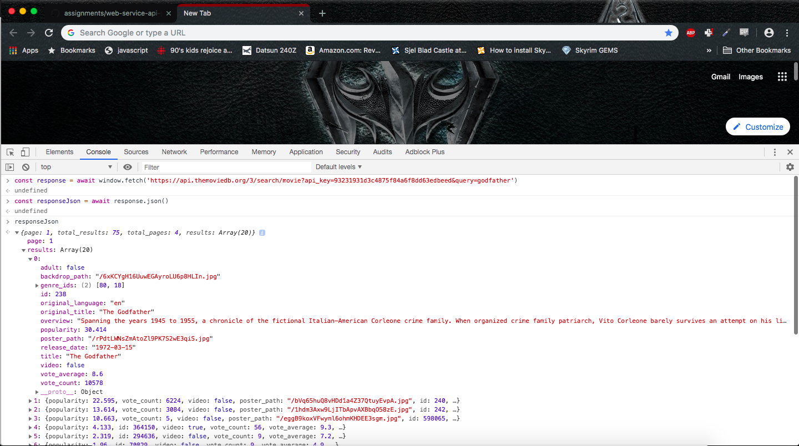

# API Setup Assignment 0919b
## Executive Summary
This Setup Assignment is for the use of TMDB's (The Movie Database) API in creating a web application that provides a Movie Search function, a Movie Recommendation Function, and a Top Rated Movies function. The overall process went rather smoothly as the API is fairly simple and well-documented, and I did not run into any unexpected errors or issues with communicating with the API via Postman nor with `window.fetch`. An API key is required, which I was able to get for free by signing up with an account and describing my intentions with it. The API key used in these setup tests is: 93231931d3c4875f84a6f8dd63edbeed . The API documentation can be found at https://developers.themoviedb.org/3/getting-started/introduction .

## Web Service Function 1: Movie Search
Using TMDb's /search/movie function allows the user to search for movies using a query, along with optional paramaters such as language, year, region, and the option to include adult films or not. The function returns the top 20 search results for the given query, and for each result includes the movie's TMDb ID number, title, poster image, language, description, release date, popularity, and rating score on the TMDb site. 

Invoking Search Request for query "godfather" in Postman:

Postman Search Results for query "godfather":

Fetch Search Request and Results for query "godfather":

From this response I plan to use the information given in `response.results[0]` to display information about the top result from the query searched. Specifically, I plan to use the data from the fields `response.results[0].title`, `response.results[0].release_date`, `response.results[0].poster_path`, `response.results[0].overview`, and `response.results[0].vote_average` to display all of this information about the specific movie searched by the user. I may also need to use this feature to get the information from `response.results[0].id` in order to get the ID number for a specific movie to be used in the Recommendation feature detailed below.

There were no errors encountered in this process, even with window.fetch, as it seemed to be a fairly straightforward search and response.

## Web Service Function 2: Movie Recommendation
TMDb's /movie/{movie_id}/recommendations function gives a list of movie recommendations similar to a given movie. As long as the movie's TMDb ID number is input into the request url, the function will return a list of 20 similar movies, each as an object with information on the movie's TMDb ID number, language, overview, title, popularity, release date, and TMDb rating. The user can choose to specify the language and page number if desired.

Invoking Recommendations Request for The Godfather (id #238) in Postman (note 238 as id number is shown in URL):

Postman Recommendation Results for The Godfather (id #238):

Fetch Recommendation Request and Results for The Godfather (id #238):

Using the ID number from the Search function detailed above, from this response I plan to use the information in `response.results[0]` to show the top result from this recommendation list, displaying the same information from the Search feature to give the user the top recommendation for a movie similar to their chosen movie.

There were no errors encountered in this process, even with window.fetch, as it again seemed to be a fairly straightforward search and response.

## Web Service Function 3: Top Rated Movies
TMDb's /movie/top_rated function returns a list of the 20 highest rated movies on the TMDb website, each containing the same information as the functions above. The user can choose to specify the language, region, and page number if desired.

Invoking Top Rated Request in Postman:

Postman Top Rated Results:

Fetch Top Rated Request and Results:

Using these results, I plan to use up to 20 of the movies returned (`response.results[0] - response.results[20]`) to display a list of the Top Rated movies from TMDb and the same information as denoted in the above functions to provide a resource for users who might want to find highly acclaimed movies to watch.

There were no errors encountered in this process, even with window.fetch, as it again seemed to be a fairly straightforward search and response.