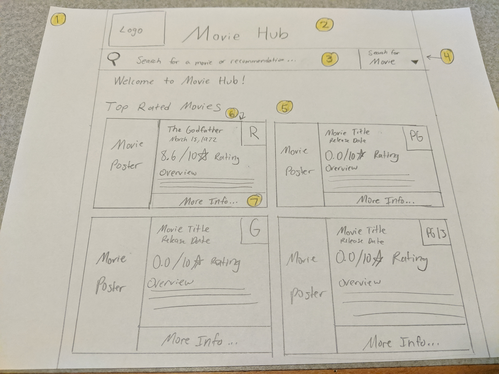
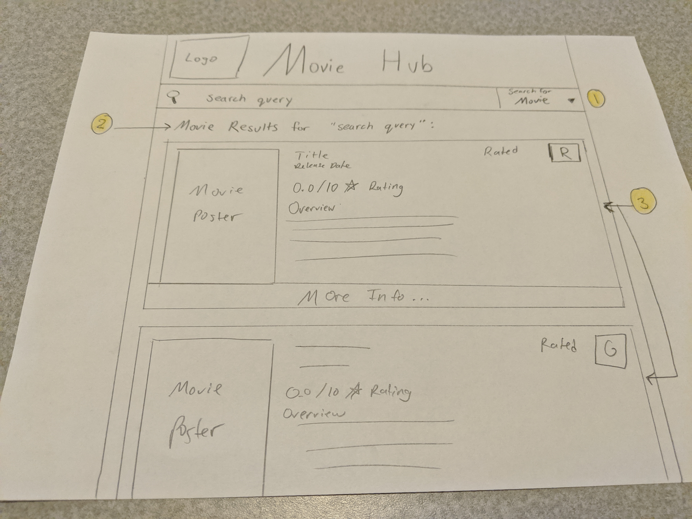
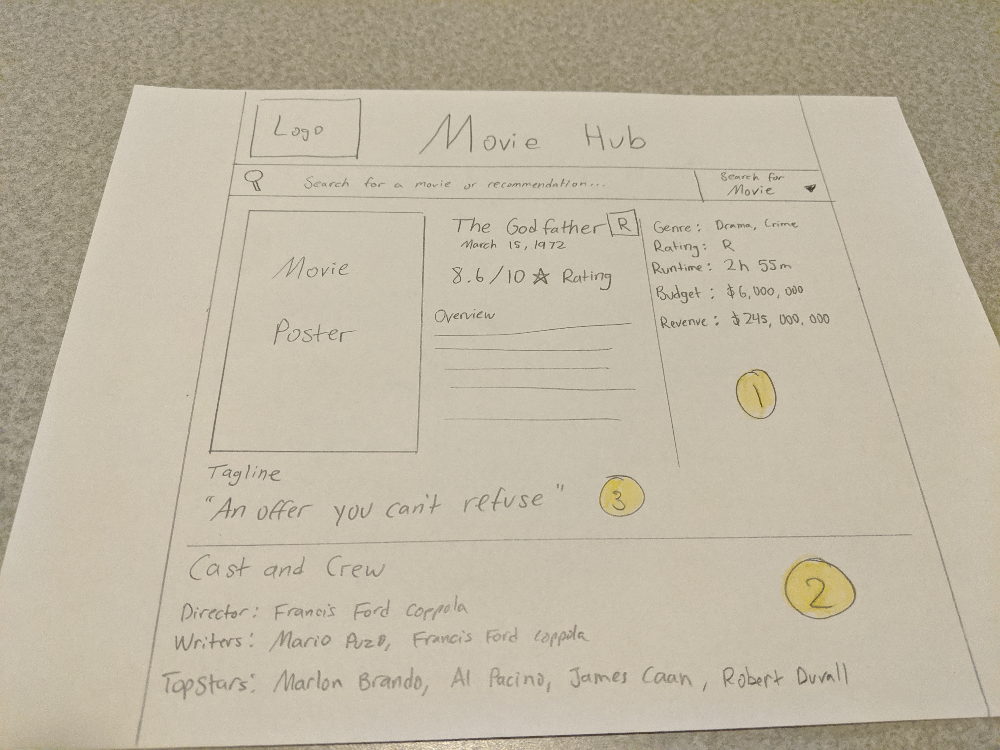
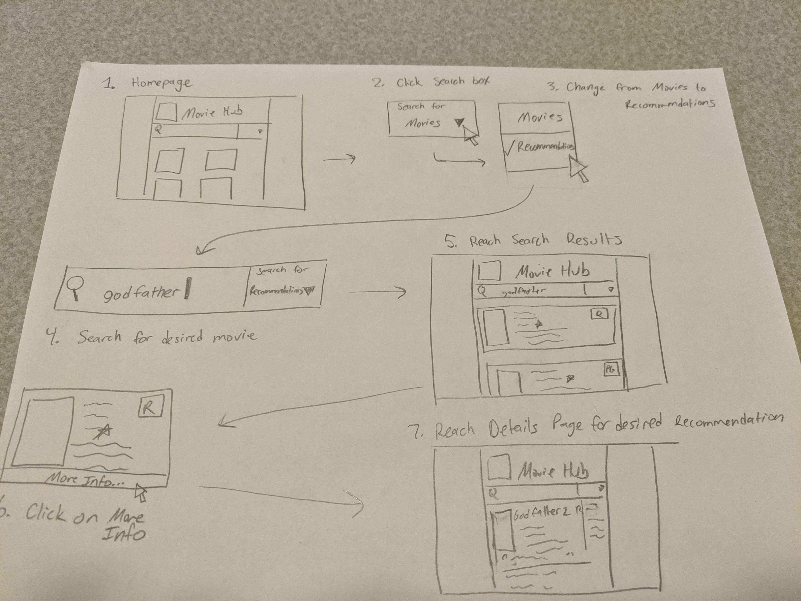
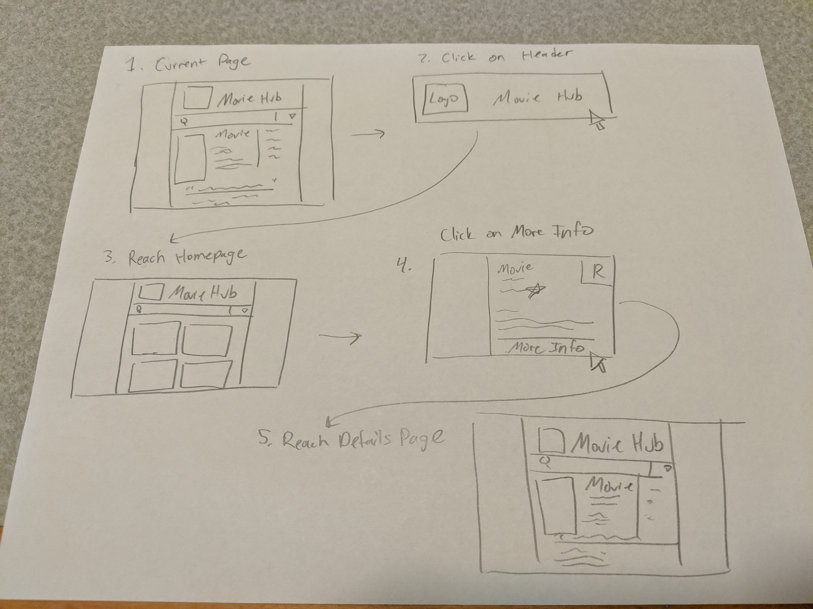

# Assignment 0919a: Front End Design and White Paper

## Application Description
The application I plan to create will be a web app that uses the API from The Movie Database (TMDb) to allow users to find information about specific movies. In particular, the main functions of the web app will be the ability to search for a specific movie and find its details and information, the ability to search for a specific movie and get a recommendation for a similar movie, and finally to display a page of the top rated movies from TMDB's website for users to find highly acclaimed titles to watch. The [TMDb website](https://themoviedb.org) provides these features and more, and their API provides the information necessary for these functions through simple function calls. 

### Web Service Used
The Web Service used for this app is the API from The Movie Database (TMDb), which is a simple, well-documented API that provides information about movies, TV shows, and actors, as well as allows for search, account, and movie rating features in combination with the TMDb website. The documentation pages for the API can be found [here](https://developers.themoviedb.org/3/getting-started/introduction). The main API calls that the application will use are:
1. The `/search/movie` function, which requires a search query and returns a list of search results in the form of twenty movie objects and their details. This will provide the movie titles for the Movie Search Results page.
2. The `/movie/{movie_id}/recommendations` function, which takes in a movie ID number (which can be found through `/search/movie`) and returns a list of twenty similar movies and their details. This will provide the information for the Recommendation Search Results page.
3. The `/movie/top_rated` function, which returns a list of the twenty highest-rated movies on the TMDb site. This will provide the information for the homepage of the site.
4. The `/movie/{movie_id}` function, which take in a movie ID number and returns more details about the movie than `/search/movie`. This will be used to provide extra information on the Movie Details page for a specific title.
5. the `/movie/{movie_id}/credits` function, which takes in a movie ID number and returns the cast and crew information for the movie. This will be used to provide the cast and crew information on the Movie Details page for a specific title. 

## Top-Level Design/Layout
The overall design of the application is loosely based off of both the [IMDb](https://imdb.com) and [TMDb](https://themoviedb.org) websites, which both provide similar features. I have drawn up three mockups to showcase the design of the three primary pages of the site, along with yellow annotation indicators that correspond to numbered annotations below.

Mockup 1: Homepage

1. Left and Right Borders: These sides of the screen serve as borders, likely an off white color
2. Header: The header is centered at the top of screen and includes a logo and the title of the site. This should be clickable and direct the user back to the homepage.
3. Search Bar: The search bar is part of the header, contains a magnifying glass symbol on the left, and allows the user to search for movies.
4. Search Type: This menu allows the user to select whether they want to search for a movie title or for a recommendation by clicking the small drop-down arrow.
5. Main Page and Top Rated: The homepage displays a welcome message and a list of the top rated movies from the site, arranged in boxes side by side, 2 per row.
6. Movie Boxes: These individual boxes will give the information about the Top Rated movies and are smaller only on the homepage to allow for more movies, and to differentiate the homepage from the search results layout.
7. More Info Button: Clicking this part of each movie box will take the user to that movie's Movie Details page, displaying more information about the specific title.

Mockup 2: Search Results Page

1. Search Type: Again, this menu is important to the Search Results Page, as the user can switch the type of search from Movie Titles, which uses `/search/movie/`, to Recommendations, which uses `/movie/{movie_id}/recommendations`.
2. Results Display Text: This will either say "Movie Results for 'search query'" OR "Recommendations similar to 'Movie Title'" depending on which search type is selected. Note that ideally the Recommendations display will use the full title of the movie instead of just the search query.
3. Movie Title Boxes: These movie title boxes will contain the same information as those in the Top Rated section of the homepage, but are elongated such that there is one item per row, to distinguish this page as a Search Results page. Also note that the More Info button spans the entire length of the bottom of the box.

Mockup 3: Movie Details Page

1. Extra Information: This section is separated by a vertical line and contains extra information about the movie title received from `/movie/{movie_id}`.
2. Cast and Crew: This section is separated from the above section with a horizontal line and contains extra information about the cast and crew of the movie received by `/movie/{movie_id}/credits`.
3. Tagline: This section will have the tagline received from `/movie/{movie_id}` in quotes, underneath the information and spanning the entire length.

Further note that this page only contains the information for one movie and spans the entire width of the page between the side borders instead of being contained within a box.

## Usage Scenarios
### Searching for a Movie Recommendation

In this scenario, a user has a movie in mind that he/she likes, and wants to find a recommendation for something similar to watch. The user would start at the homepage, shown in step 1, and proceed in step 2 to click on the drop down arrow in the Search Type box, located at the far right of the search bar. This menu element allows the user to change his/her search criteria from Movies to Recommendations. At this point the user types the name of their movie into the search box, in this case represented in the search query "godfather." If the user clicks on the magnifying glass or presses the 'enter' key, their search will take them to the Search Results page, shown in step 5, which displays a list of movies recommended based on similarity to The Godfather. Then if the user clicks on the More Info section of one of the results, as shown in step 6, they will finally reach the details page for the recommended movie, seen in step 7, which will give them the most information about their choice of recommended movie.

### Returning to Homepage and Finding Details on a Top Rated Movie

In this scenario, the user is on a page within the website and wishes to return back to the homepage, find a Top Rated movie, and find more information about it. The user starts on their current page and clicks on any part of the header, seen in step 2. The user will then reach the homepage, where the Top Rated movies are listed in information boxes. From here, if the user clicks on the More Info section of a particular movie box, they will finally reach the Movie Details page giving them the most information about their chosen movie.

## Design Rationale
I designed my user interface primarily using a visual layout that I find subjectively appealing, as well as combining elements from the IMDb and TMDb sites that I felt best satisfied specific guidelines and principles of Interaction Design. The use of certain elements such as the left and right borders, Main header, and central search bar appeal to consistency in their similarity to other websites and system designs, following the first "Golden Rule," "Strive for Consistency" (Shneiderman). The importance of consistency represented here is not only derived from Shneiderman, however, as every major source, including Bruce Tognazzini, Don Norman, and Jakob Nielsen, all include Consistency as an important principle in Interaction Design. The principle of Fitts' Law (Tognazzini) is also incorporated in my design in making the movie info boxes larger, and placing important elements closer to the header and search bar, making them easier to access. Other design decisions incorporate Jakob Nielsen's 10 Usability Heuristics, particularly those of providing a "match between the system and the real world" through metaphors such as the magnifying glass in the search bar, as well as an "aesthetic and minimalist design" in the simplicity and minimal text clutter used in my design layout overall. Furthermore, I have incorporated another one of Shneiderman's "8 Golden Rules" in "catering to universal usability" by ensuring that specific labels such as movie ratings, heading icons, and info boxes are not solely beholden to the use of color to display information, ensuring that color blind users will not be negatively impacted. Finally, I incorporated guidelines from the usability.gov website, including "Enable users to access the homepage from any other page on the Web site," in having a constant header that redirects to the homepage; "Place Important Items at Top Center" with the very same header providing the most important resources in the top center; and "Provide a Search Option on Each Page," accomplished through the same consistency of the header and search bar through the site's layout. Overall, I attempted to incorporate as many design principles and guidelines as I could through a relatively simple interface that would provide as much information to the user as possible in an efficient and orderly manner.    
 
## Usability Metric Forecast
I believe my design will effectively satisfy all five usability metrics, however, I have ranked them in the order that I feel my design satisfies greatest to least.
1. Learnability: I feel that my design will most effectively satisfy learnability because it is a very simple design that utilizes common menu elements such as the search bar to remain consistent with common user interfaces, which will make the system easy for the user to use and understand without having any prior experience.
2. Memorability: I feel that my design will satisfy memorability in a similar way to learnability because of its simplicity, in that its use of common menu elements and easily understood operations will allow returning users to remember what each feature does.
3. Efficicency: I feel that my design will satisfy efficiency because every feature of the site can be accessed with only a few clicks and/or one search, allowing for users to quickly navigate through the three main pages seen in the design.
4. Errors: I feel that my design should satisfy this usability metric by having relatively few opportunities for errors and clearly marked features, but I have listed it lower in the list because there are a few potential error scenarios that could be forseen, such as improper use of the movie/recommendation search feature. 
5. Subjective Satisfaction: While I personally feel that my design is subjective pleasing due to the incorporation of elements I personally like from both the IMDb and TMDb sites, I have listed this as the weakest metric simply because I am inexperienced at designing user interfaces and cannot be sure if others will find it subjectively pleasing until it has been tested on other users.

## References
Ben Shneiderman and Catherine Plaisant. Design-ing the User Interface: Strategies for Effective Human-Computer Interaction, 5th Edition, Addison Wesley/Pearson, 2009.

Bruce Tognazzini. First Principles of Interaction Design (Revised & Expanded), https://asktog.com/atc/principles-of-interaction-design/

Donald A. Norman. The Design of Everyday Things, Basic Books, 2002.

Jakob Nielsen. Usability Engineering, Morgan Kaufmann, 1994.

Usability.gov. https://guidelines.usability.gov/
